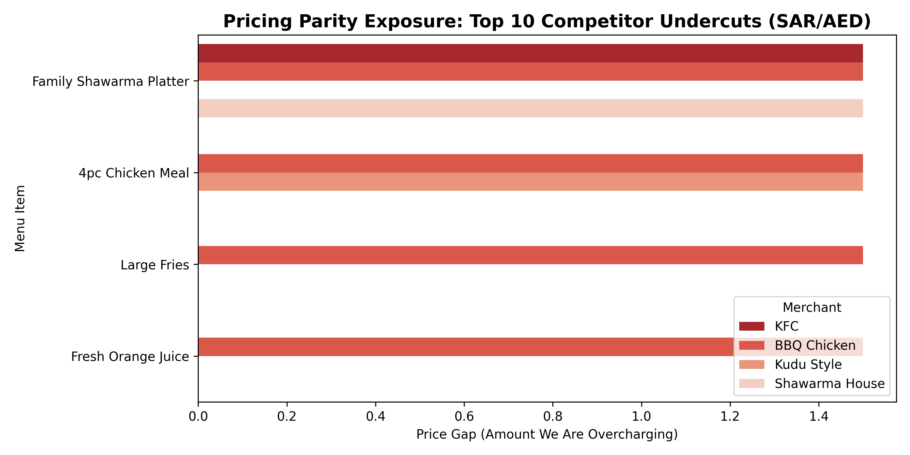

# Production App API Parsing & Pricing Integrity Pipeline

## Project Overview
In hyper-competitive quick-commerce and food delivery markets, platform pricing parity directly dictates customer retention and overall Gross Merchandise Value (GMV).
This project replicates a real-world operational analytics system that automates competitor price tracking. It eliminates slow, manual pricing audits by parsing raw, nested mobile app API responses at scale, evaluating market data against internal metrics through an embedded relational engine to flag Beat-Match-Lose (BML) parity violations instantly.

---

## Technical Workflow
* **Data Engineering Layer:** Ingests multi-layered nested JSON structures (replicating raw mobile backend app API logs) across 100+ simulated menu items and flattens them into analytics-ready frames using vectorized normalization logic.
* **Relational Parity Layer:** Maps flattened market frames into an in-memory SQL database (`SQLite3`), executing programmatic joins across platform SKUs to isolate and categorize items into a standardized **Beat-Match-Lose (BML)** index.
* **Visual Intelligence Layer:** Filters active platform pricing deficits to plot an operational exposure visualization (`pricing_parity_gap.png`), tracking the exact financial margins by which the platform is being undercut.
* **Automated Alerting Engine:** Programmatically monitors relational states for critical parity violations, dynamically printing localized commercial markdown payloads for target operational mitigation.

---

## Tech Stack
* **Language:** Python 3 (Pandas, JSON Parsing, Data Regularization)
* **Querying:** SQL (SQLite3)
* **Data Visualization:** Matplotlib, Seaborn
* **Operations:** Automated Conditional Process Logic
